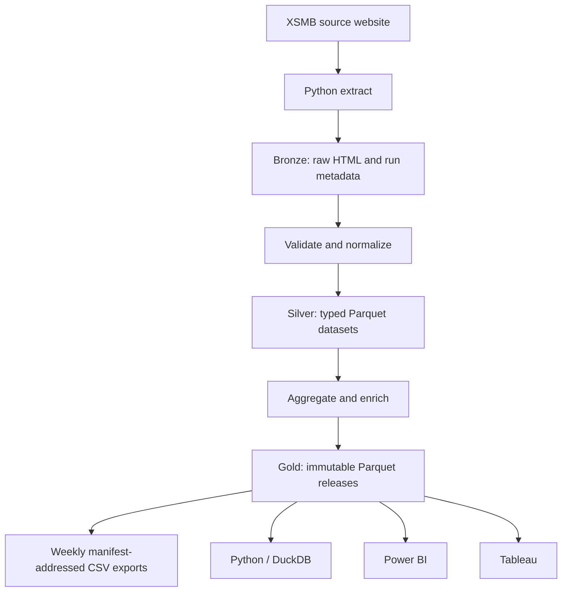

# Vietnam Lottery ETL and Cloudflare R2 Data Lake Enhancement

This started as the XSMB implementation specification. The implemented platform now runs independent XSMB, XSMN,
and XSMT lakes; current operational truth lives in `README.md` and `docs/operations.md`.

## 1. Document purpose

This document is the implementation specification for enhancing the forked repository:

- Upstream: `khiemdoan/vietnam-lottery-xsmb-analysis`
- Fork: `anhxuanpham/vietnam-lottery-xsmb-analysis`
- Primary goal: use the project as a practical ETL, data engineering, data quality, Python analytics, Power BI, and Tableau learning project.
- Storage target: Cloudflare R2 using its S3-compatible API.

The implementation must preserve the educational value of the original project while improving reliability, data lineage, storage design, testability, and BI usability.

This project performs descriptive analysis only. It must not claim that historical lottery results can reliably predict future results.

## 2. Desired outcome

After implementation, the system must:

1. Fetch the latest XSMB result from the configured source.
2. Preserve the raw source response in an immutable Bronze layer.
3. Validate and normalize the result into Silver Parquet datasets.
4. Generate immutable BI-friendly Gold Parquet releases and separate manifest-addressed CSV exports.
5. Upload all data layers to Cloudflare R2.
6. Run automatically every day through GitHub Actions.
7. Detect missing dates and retry gaps instead of relying only on the maximum stored date.
8. Produce a data-quality report for every ETL run.
9. Avoid committing generated datasets, Parquet files, and chart images to Git.
10. Allow local execution without exposing Cloudflare credentials.
11. Support Python and DuckDB analysis directly against R2.
12. Provide stable CSV endpoints for Power BI and Tableau learning exercises.

## 3. Non-goals

Do not add the following in the initial implementation:

- Apache Spark.
- Kafka.
- Airflow.
- Kubernetes.
- A predictive lottery model presented as a reliable betting tool.
- A public API with authentication and user management.
- Supabase as the source of truth.
- Destructive Git history rewriting.

These technologies would add complexity without providing meaningful value for the current dataset size.

## 4. Target architecture



Cloudflare R2 is an object store, not a relational database or SQL query engine. Python and DuckDB perform the transformations and analytical queries. R2 stores versioned data objects.

## 5. R2 bucket layout

Each region owns an independent bucket. One representative regional layout is:

```text
xsmb-data-lake/
├── bronze/
│   └── source=xoso/
│       └── year=2026/
│           └── month=07/
│               └── date=2026-07-16/
│                   ├── response.html
│                   ├── parsed-result.json
│                   └── metadata.json
├── silver/
│   ├── draw-results/
│   │   └── year=2026/month=07/draw-results.parquet
│   └── loto-daily/
│       └── year=2026/month=07/loto-daily.parquet
├── gold/
│   ├── releases/
│   │   └── run-id=<uuid>/
│   │       ├── fact-draw-result.parquet
│   │       ├── fact-loto-daily.parquet
│   │       ├── fact-special-prize.parquet
│   │       ├── dim-date.parquet
│   │       └── dim-number.parquet
│   └── snapshots/
│       └── as-of=2026-07-16/run-id=<uuid>/manifest.json
├── exports/
│   └── csv/
│       ├── latest.json
│       └── run-id=<uuid>/*.csv
├── quality/
│   └── year=2026/month=07/date=2026-07-16/
│       └── report.json
└── manifests/
    ├── latest.json
    └── runs/
        └── run-id=<uuid>.json
```

### Storage rules

- Bronze objects are immutable. Never overwrite a successful raw response unless `--force` is explicitly provided.
- Store one Bronze object group per draw date.
- Compact Silver Parquet files by month to avoid the small-file problem.
- Gold release objects are immutable; only the validated `manifests/latest.json` pointer moves by compare-and-swap.
- Publish an immutable Gold snapshot manifest only after all required objects are uploaded successfully.
- Consumers must use `manifests/latest.json` to identify the most recent complete dataset.
- Do not treat a partially uploaded run as the latest successful run.

## 6. Proposed source structure

Refactor the scripts into an installable Python package while retaining thin compatibility wrappers if needed.

```text
src/
└── xsmb_etl/
    ├── __init__.py
    ├── cli.py
    ├── config.py
    ├── models.py
    ├── extract.py
    ├── transform.py
    ├── quality.py
    ├── r2.py
    ├── repository.py
    ├── marts.py
    ├── pipeline.py
    └── logging_config.py
tests/
├── fixtures/
│   ├── valid-result-page.html
│   ├── invalid-result-page.html
│   └── changed-layout-page.html
├── test_extract.py
├── test_transform.py
├── test_quality.py
├── test_r2.py
├── test_marts.py
└── test_pipeline.py
sql/
├── analysis-examples.sql
└── data-quality-checks.sql
docs/
├── data-dictionary.md
├── power-bi.md
└── tableau.md
.github/
└── workflows/
    ├── ci.yml
    └── daily-etl.yml
```

### Module responsibilities

#### `config.py`

- Load environment variables with `pydantic-settings`.
- Validate required R2 settings.
- Build the R2 endpoint from the account ID when an explicit endpoint is not supplied.
- Separate local, test, and production configuration.
- Never print secrets in logs or exception messages.

#### `models.py`

- Define the canonical lottery result model.
- Validate prize counts and numeric ranges.
- Define ETL run metadata and quality-report models.
- Preserve leading-zero semantics through explicit prize width metadata or formatted string fields.

#### `extract.py`

- Fetch a selected date with a finite timeout.
- Retry transient failures with exponential backoff.
- Validate the HTTP response before parsing.
- Confirm that the returned page represents the requested date.
- Parse all prize groups only after verifying their expected counts.
- Return both raw response bytes and a validated canonical result.

#### `transform.py`

- Convert canonical results to DataFrames.
- Sort all data explicitly by `draw_date`.
- Produce long-form draw results.
- Produce daily `00` to `99` occurrence records.
- Preserve deterministic column order and data types.

#### `quality.py`

- Run schema, uniqueness, completeness, range, and business-rule checks.
- Return a structured report rather than only printing errors.
- Fail the pipeline on critical validation errors.
- Allow warnings for expected non-draw dates when explicitly classified.

#### `r2.py`

- Create an S3-compatible R2 client.
- Upload and download bytes and files.
- Check object existence and metadata.
- Set content types and cache-control headers.
- Support dependency injection so tests do not contact R2.

#### `repository.py`

- Abstract Bronze, Silver, Gold, manifest, and quality-report storage operations.
- Implement idempotent writes.
- Locate missing dates by comparing expected dates, success records, and explicit non-draw records.

#### `marts.py`

- Build Power BI and Tableau friendly fact and dimension tables.
- Produce both Parquet and CSV versions of Gold tables.
- Keep descriptive statistics separate from predictive claims.

#### `pipeline.py`

- Coordinate Extract, Validate, Transform, Load, and Publish steps.
- Generate a unique `run_id`.
- Publish the latest manifest only after the entire run succeeds.
- Record failure metadata without marking the run as successful.

#### `cli.py`

Provide commands such as:

```bash
uv run xsmb-etl run --target-date 2026-07-16
uv run xsmb-etl run --target-date 2026-07-16 --force
uv run xsmb-etl backfill --from 2005-10-01 --to 2026-07-16
uv run xsmb-etl build-gold
uv run xsmb-etl validate
uv run xsmb-etl download-gold --output ./downloads
```

## 7. Configuration

Create `.env.example` with placeholders only:

```dotenv
ETL_ENV=local
SOURCE_BASE_URL=https://xoso.com.vn
HTTP_TIMEOUT_SECONDS=30
HTTP_MAX_RETRIES=3

R2_ACCOUNT_ID=
R2_ACCESS_KEY_ID=
R2_SECRET_ACCESS_KEY=
R2_BUCKET_NAME=xsmb-data-lake
R2_ENDPOINT_URL=
R2_REGION=auto
R2_PUBLIC_BASE_URL=

LOG_LEVEL=INFO
```

Required GitHub Actions secrets:

```text
R2_ACCOUNT_ID
R2_ACCESS_KEY_ID
R2_SECRET_ACCESS_KEY
R2_BUCKET_NAME
```

Optional repository variables:

```text
R2_PUBLIC_BASE_URL
SOURCE_BASE_URL
```

Security requirements:

- Use a bucket-scoped R2 token.
- Grant only the minimum object read/write permissions required by the ETL workflow.
- Store credentials only in GitHub Actions Secrets or a local ignored `.env` file.
- Never place credentials in source files, Markdown, workflow logs, screenshots, or committed configuration.
- Never run an R2 upload workflow with secrets on untrusted pull-request code.

## 8. R2 client implementation requirement

Use `boto3` with the Cloudflare R2 S3-compatible endpoint.

Illustrative implementation shape:

```python
import boto3


def create_r2_client(settings):
    endpoint = settings.r2_endpoint_url or (
        f"https://{settings.r2_account_id}.r2.cloudflarestorage.com"
    )

    return boto3.client(
        "s3",
        endpoint_url=endpoint,
        aws_access_key_id=settings.r2_access_key_id,
        aws_secret_access_key=settings.r2_secret_access_key,
        region_name=settings.r2_region,
    )
```

The final implementation must additionally:

- Configure connection and read timeouts.
- Retry transient R2 errors.
- Attach `ContentType` metadata.
- Attach `CacheControl` metadata for public Gold objects.
- Calculate and store a SHA-256 checksum in object metadata.
- Avoid logging credentials or signed URLs.
- Use mocks or a local S3-compatible test double in unit tests.

Recommended content types:

| Extension | Content type |
|---|---|
| `.json` | `application/json; charset=utf-8` |
| `.csv` | `text/csv; charset=utf-8` |
| `.parquet` | `application/vnd.apache.parquet` |
| `.html` | `text/html; charset=utf-8` |

## 9. Canonical data models

### 9.1 `fact_draw_result`

Use long-form data instead of retaining 27 prize columns in the Gold layer.

| Column | Type | Description |
|---|---|---|
| `draw_date` | date | Official draw date |
| `prize_group` | string | `special`, `prize1`, ..., `prize7` |
| `prize_order` | int | Order inside the prize group |
| `prize_width` | int | Official number width |
| `full_number` | int | Numeric result |
| `formatted_number` | string | Result padded with leading zeros |
| `loto_2d` | string | Last two digits, always two characters |
| `tens_digit` | int | Tens digit of `loto_2d` |
| `ones_digit` | int | Ones digit of `loto_2d` |
| `source_url` | string | Source page URL |
| `run_id` | string | ETL run identifier |

Expected rows per successful draw date: `27`.

### 9.2 `fact_loto_daily`

Generate exactly 100 rows per successful draw date.

| Column | Type | Description |
|---|---|---|
| `draw_date` | date | Draw date |
| `number_2d` | string | `00` through `99` |
| `frequency` | int | Occurrences in the 27 results |
| `appeared` | bool | `frequency > 0` |
| `draws_since_previous` | nullable int | Number of draws since previous appearance |
| `calendar_days_since_previous` | nullable int | Calendar-day difference |
| `rolling_7_frequency` | int | Previous/current seven-draw frequency, documented precisely |
| `rolling_30_frequency` | int | Previous/current 30-draw frequency |
| `rolling_90_frequency` | int | Previous/current 90-draw frequency |

Do not use zero to represent a number that has never appeared in the analysis window. Use null and an explicit status.

### 9.3 `fact_special_prize`

| Column | Type | Description |
|---|---|---|
| `draw_date` | date | Draw date |
| `full_number` | int | Special prize result |
| `formatted_number` | string | Five-character zero-padded result |
| `tail_2d` | string | Last two digits |
| `first_digit` | int | First digit |
| `last_digit` | int | Last digit |
| `digit_sum` | int | Sum of all digits |
| `is_even_tail` | bool | Whether the last digit is even |

### 9.4 `dim_number`

Generate 100 deterministic rows.

| Column | Type | Description |
|---|---|---|
| `number_2d` | string | `00` through `99` |
| `numeric_value` | int | Numeric value |
| `tens_digit` | int | Tens digit |
| `ones_digit` | int | Ones digit |
| `digit_sum` | int | Sum of both digits |
| `is_even` | bool | Based on numeric value |
| `is_double` | bool | `00`, `11`, ..., `99` |

### 9.5 `dim_date`

Include:

- Date.
- Day of week.
- ISO week.
- Month.
- Quarter.
- Year.
- Weekend flag.
- Draw status: `success`, `no_draw`, `missing`, or `failed`.

Do not silently infer that every missing calendar date is a data error. Maintain explicit draw status.

## 10. Data-quality rules

Every successful run must evaluate at least the following checks.

### Critical checks

1. Requested date matches the date represented by the source page.
2. Exactly one special prize exists.
3. Exactly one prize 1 result exists.
4. Exactly two prize 2 results exist.
5. Exactly six prize 3 results exist.
6. Exactly four prize 4 results exist.
7. Exactly six prize 5 results exist.
8. Exactly three prize 6 results exist.
9. Exactly four prize 7 results exist.
10. Total result count is exactly 27.
11. Prize values fall inside the valid numeric range for their prize width.
12. The draw date is not in the future.
13. `fact_draw_result` has 27 rows for the draw date.
14. `fact_loto_daily` has 100 rows for the draw date.
15. Sum of `fact_loto_daily.frequency` is 27.
16. `number_2d` covers exactly `00` through `99`.
17. No duplicate business key exists.
18. All Gold files are generated from the same dataset version and `run_id`.

### Warning checks

- Source response took longer than the warning threshold.
- A result differs from an already stored successful result for the same date.
- A calendar-date gap has not been classified as `no_draw` or `failed`.
- Frequency distribution differs materially from the configured historical baseline.

Warnings must be recorded but must not automatically be presented as evidence of predictability or manipulation.

## 11. Idempotency and gap recovery

The original implementation starts from the maximum stored date. This can permanently miss an earlier date when a middle request fails but a later request succeeds.

Replace this behavior with a control-state model:

1. Read successful, failed, missing, and no-draw dates from manifests or metadata.
2. Generate the expected processing date range.
3. Retry unresolved `failed` and `missing` dates.
4. Skip successful dates unless `--force` is supplied.
5. Never classify a failed request as a non-draw date automatically.
6. Make repeated successful runs produce the same logical output.
7. Detect source corrections and require explicit `--force` before replacing canonical data.

Use `draw_date` as the main business key.

## 12. Historical migration

Historical raw HTML is not available in the current repository, so migration must preserve lineage honestly.

### Migration process

1. Read the existing `data/xsmb.json` dataset.
2. Validate every historical row through the new canonical model.
3. Mark its source lineage as `legacy_repository_dataset`.
4. Do not pretend that a historical raw HTML response exists.
5. Build Silver monthly Parquet files.
6. Build all Gold fact and dimension tables.
7. Upload the migration manifest.
8. Compare record counts, minimum date, maximum date, duplicate dates, and missing calendar dates.
9. Save a migration quality report.
10. Switch future daily runs to the new raw-response Bronze process.

Migration must be rerunnable and idempotent.

## 13. Git and repository changes

The repository must stop using Git as the data lake.

### Stop committing

- Generated CSV datasets.
- Generated JSON datasets.
- Generated Parquet datasets.
- Generated JPEG/PNG analysis images.
- Dynamically rewritten README results.

Keep only small, stable fixtures required for tests.

Suggested `.gitignore` additions:

```gitignore
.env
.venv/
.pytest_cache/
.ruff_cache/
downloads/
output/
data/generated/
images/generated/
*.duckdb
*.duckdb.wal
```

Do not rewrite the existing Git history in the first enhancement pull request. Prevent future growth first. Historical cleanup can be a separate, explicitly approved operation.

## 14. GitHub Actions design

### `ci.yml`

Run on pull requests and pushes to the development branch.

Required steps:

1. Checkout.
2. Install `uv`.
3. Install the locked dependencies.
4. Run Ruff formatting check.
5. Run Ruff linting.
6. Run all unit tests.
7. Run a local fixture-based pipeline without R2 credentials.

The CI workflow must not receive production R2 secrets for untrusted pull-request code.

### `daily-etl.yml`

Requirements:

```yaml
name: Daily XSMB ETL

on:
  workflow_dispatch:
    inputs:
      target_date:
        description: Optional YYYY-MM-DD draw date
        required: false
      force:
        description: Replace an existing successful date
        type: boolean
        default: false
  schedule:
    - cron: "35 11 * * *"

permissions:
  contents: read

concurrency:
  group: xsmb-daily-etl
  cancel-in-progress: false
```

Additional requirements:

- Remove the original owner condition tied to `khiemdoan`.
- Do not commit or push generated datasets back to `main`.
- Upload data to R2 instead.
- Set an explicit job timeout.
- Run data-quality checks before publishing Gold.
- Write a concise result to the GitHub Actions job summary.
- Fail visibly when extraction, validation, upload, or manifest publication fails.
- Pin third-party GitHub Actions to immutable commit SHAs.

## 15. Power BI serving strategy

Power BI should consume the immutable CSV release selected by `exports/csv/latest.json` through a curated router.

Example stable URL:

```text
https://data.example.com/xsmb/exports/csv/run-id=<resolved-run-id>/fact-loto-daily.csv
```

Example Power Query:

```powerquery
let
    Source = Csv.Document(
        Web.Contents(
            "https://data.example.com/xsmb/exports/csv/run-id=<resolved-run-id>/fact-loto-daily.csv"
        ),
        [Delimiter=",", Encoding=65001, QuoteStyle=QuoteStyle.Csv]
    ),
    Headers = Table.PromoteHeaders(Source, [PromoteAllScalars=true])
in
    Headers
```

Rules:

- Keep Bronze and Silver private.
- Expose only curated Gold CSV objects.
- Use a Cloudflare custom domain for stable access.
- Do not use expiring presigned URLs as a long-term scheduled-refresh source.
- Document column types in `docs/data-dictionary.md`.
- Keep Parquet versions for Python and DuckDB even when Power BI consumes CSV.

## 16. Tableau serving strategy

Initial approach:

1. Download Gold CSV or Parquet files from the stable R2 custom domain.
2. Open the downloaded data in Tableau Desktop.
3. Build and save Tableau workbooks separately from the ETL source code.

Possible later enhancements:

- Generate Tableau `.hyper` extracts with the Hyper API.
- Build a Tableau Web Data Connector.
- Publish curated data sources to Tableau Cloud or Tableau Server.

Do not make Tableau connector development a blocker for the initial R2 implementation.

## 17. Python and DuckDB access

Support querying Parquet directly from R2 through DuckDB's S3-compatible support.

Example analytical workflow:

```sql
INSTALL httpfs;
LOAD httpfs;

CREATE SECRET r2_secret (
    TYPE r2,
    KEY_ID '<R2_ACCESS_KEY_ID>',
    SECRET '<R2_SECRET_ACCESS_KEY>',
    ACCOUNT_ID '<R2_ACCOUNT_ID>'
);

-- Resolve this run ID from manifests/latest.json and verify its object references.
SET VARIABLE gold_root = 'r2://xsmb-data-lake/gold/releases/run-id=<resolved-run-id>';

SELECT
    number_2d,
    SUM(frequency) AS total_frequency
FROM read_parquet(
    getvariable('gold_root') || '/fact-loto-daily.parquet'
)
GROUP BY number_2d
ORDER BY total_frequency DESC;
```

Do not commit real credentials in SQL examples. Use placeholders or environment-based secret creation.

## 18. Recommended Python dependencies

Keep dependencies intentional and remove unused packages.

Recommended runtime dependencies:

```text
boto3
beautifulsoup4
cloudscraper
duckdb
jinja2
lxml
matplotlib
numpy
pandas
pandera
pyarrow
pydantic
pydantic-settings
seaborn
tenacity
tzdata
```

Recommended development dependencies:

```text
pytest
pytest-cov
ruff
```

Polars and Plotly may be added as educational extensions, but they are not required for the first R2 implementation.

## 19. Local development workflow

```bash
git switch -c feature/r2-data-lake

cp .env.example .env
uv sync

uv run ruff format --check .
uv run ruff check .
uv run pytest

# Run only against local files and fixtures
uv run xsmb-etl validate

# Execute one date after local R2 credentials are configured
uv run xsmb-etl run --target-date 2026-07-16
```

The project must provide a local mode that writes to `output/` and does not require R2 credentials. This is necessary for tests and safe development.

## 20. Implementation phases

### Phase 1: Foundation

- Create the `xsmb_etl` package.
- Implement typed configuration.
- Implement canonical models.
- Add fixture-based extraction tests.
- Add timeout, retry, and prize-count validation.
- Preserve current output behavior locally.

### Phase 2: Data transformation and quality

- Build long-form fact tables.
- Build date and number dimensions.
- Add critical data-quality rules.
- Add quality-report serialization.
- Add idempotency and gap detection.

### Phase 3: R2 storage

- Add the R2 client.
- Implement Bronze upload.
- Implement Silver monthly Parquet output.
- Implement immutable Gold Parquet output plus an on-demand/weekly CSV export.
- Implement manifest publication.
- Add mocked R2 tests.

### Phase 4: Historical migration

- Validate the legacy JSON dataset.
- Backfill Silver and Gold.
- Upload migration reports and manifests.
- Reconcile row counts and date coverage.

### Phase 5: Automation

- Replace the original daily update workflow.
- Add CI.
- Configure Actions secrets and repository variables.
- Verify manual and scheduled execution.

### Phase 6: Analytics and BI

- Document the Gold schema.
- Build Power BI exercises.
- Build Tableau exercises.
- Add Python notebooks and DuckDB SQL examples.

Implement one phase at a time. Each phase must leave the repository in a working and tested state.

## 21. Acceptance criteria

The R2 enhancement is accepted only when all of the following are true:

- A local fixture-based run succeeds without Internet or R2 credentials.
- A live run stores the raw response and metadata in Bronze.
- Every successful date produces exactly 27 long-form draw rows.
- Every successful date produces exactly 100 daily loto rows.
- Daily loto frequency sums to 27.
- Re-running the same successful date without `--force` creates no duplicate logical records.
- A failed middle date is retried even when later dates succeed.
- Silver Parquet is partitioned or compacted by month.
- Gold fact and dimension tables are published as immutable Parquet and can be materialized as immutable CSV exports.
- The latest manifest is updated only after all objects are uploaded successfully.
- No secrets appear in Git, logs, tests, documentation, or generated output.
- GitHub Actions no longer commits generated data and images to the repository.
- CI runs linting and tests.
- Power BI can read at least one Gold CSV through a stable URL.
- Python or DuckDB can read at least one Gold Parquet object directly from R2.
- The README clearly states that the analysis is descriptive and not a reliable prediction system.

## 22. Suggested educational analytics

Use the Gold layer for the following learning exercises:

- Frequency heatmap for `00` through `99`.
- Rolling 7, 30, 90, and 365 draw frequency.
- Distribution of waiting time between appearances.
- Calendar days versus draw-count gaps.
- Special-prize tail analysis.
- Weekday and month comparisons.
- Chi-square goodness-of-fit testing.
- Expected versus observed frequency.
- Z-score visualization with multiple-comparison warnings.
- Data completeness and pipeline-health dashboard.
- Performance comparison between Pandas, Polars, and DuckDB.

Any statistical result must distinguish descriptive correlation from predictive evidence.

## 23. Instructions for the coding agent

Use the following instructions when assigning this specification to Codex or another coding agent:

> Read this entire specification and inspect the existing repository before editing. Start with Phase 1 only. Preserve working behavior, add tests before risky refactoring, and do not implement later phases prematurely. Do not request or hard-code production credentials. Use local fixtures and dependency injection. Run formatting, linting, and tests before reporting completion. Summarize files changed, commands run, test results, unresolved risks, and the exact next phase. Do not commit generated datasets or rewrite Git history.

Recommended first task prompt:

```text
Implement Phase 1 from R2_DATA_LAKE_ENHANCEMENT.md.

Requirements:
- Inspect the current repository before making changes.
- Create the xsmb_etl package and typed configuration.
- Move extraction and canonical models behind tested interfaces.
- Add finite HTTP timeouts, retries, expected prize-count validation,
  and selected-date validation.
- Preserve current local dataset behavior.
- Add saved HTML fixtures and unit tests.
- Do not add R2 uploads yet.
- Do not modify Git history.
- Run Ruff and pytest.
- At the end, report changed files, test results, remaining risks,
  and the proposed Phase 2 plan.
```

## 24. Official technical references

- Cloudflare R2 S3 compatibility: <https://developers.cloudflare.com/r2/api/s3/api/>
- Cloudflare R2 authentication: <https://developers.cloudflare.com/r2/api/tokens/>
- Cloudflare R2 pricing: <https://developers.cloudflare.com/r2/pricing/>
- Cloudflare R2 public buckets: <https://developers.cloudflare.com/r2/buckets/public-buckets/>
- DuckDB Cloudflare R2 import: <https://duckdb.org/docs/stable/guides/network_cloud_storage/cloudflare_r2_import.html>
- Power Query Parquet connector limitations: <https://learn.microsoft.com/en-us/power-query/connectors/parquet>
- Power Query Web connector: <https://learn.microsoft.com/en-us/power-query/connectors/web/web>
- Tableau Web Data Connector: <https://help.tableau.com/current/pro/desktop/en-us/examples_web_data_connector.htm>
- GitHub Actions secrets: <https://docs.github.com/actions/security-guides/using-secrets-in-github-actions>
